<div align="center">

# Healthy AI Code MCP

<p align="center">
  
</p>

**The independent, local verification layer for AI-generated code.**

An MCP server that gives AI assistants an objective, score-based health signal — and the tooling to act on it — so generated code is refactored until it is genuinely safe to keep.

<p align="center">
  <a href="https://www.buymeacoffee.com/YOUR_USERNAME"></a>
  &nbsp;
  <a href="https://www.paypal.com/donate/?hosted_button_id=YOUR_ID"></a>
</p>

<p align="center">
  
  
  
  
  = 18">
  
</p>

</div>

---

## Why this exists

AI assistants write a lot of code, fast. What they lack is an **objective, second opinion** on whether that code is healthy — one that the model cannot talk its way around. Asking the same model "is this good?" just produces more of the same model.

Healthy AI Code MCP is that second opinion. It is:

- **Local** — runs entirely on your machine over stdio. No account, no upload, no telemetry-by-default. Your code never leaves the box.
- **Objective** — a deterministic score derived from 55 biomarkers via a published formula. Same code in, same score out, every time.
- **Open** — the scoring spec (formula, every weight, every detection threshold) is published as the **OCHS** standard under MIT + CC BY 4.0, so any tool can reproduce the number.
- **Actionable** — it doesn't just grade; it returns the next refactoring step and verifies that the refactoring preserved behavior, driving a self-correcting loop until the score hits the target.

> **Honest status (2026-06):** This project's *goal* is to become the best-in-class verification layer for AI-generated code. That is a stated direction, **not** a current claim. Where it stands today, measured independently: **measurably competitive, honestly validated, and proven robust — and statistically better than PMD at predicting human-labelled code smells on Java.** It is *not* world-best yet, and this README never pretends otherwise. See [Benchmarks](#verified-benchmarks-honest) for the exact numbers and their scope.

---

## See it work: messy → healthy

The banner above is the real workflow. Here is the concrete example behind it — a behavior-preserving refactor of an order-pricing function ([`before-after/refactor-demo/`](before-after/refactor-demo/)):

| | **Before** (`processOrder`) | **After** (`priceOrder`) |
|---|---|---|
| Signature | 8 positional params, all `any` | one typed `OrderPricing` object |
| Nesting | up to 5 levels deep | flat, single-purpose helpers |
| Magic numbers | 14 inline literals | named constants + rate tables |
| Structure | one function does everything | 6 small, documented functions |
| Docs | none | JSDoc on every function |

Across a larger fixture set ([`before-after/benchmark-sprint50/`](before-after/)), an LLM driving the loop took files from red to AI-ready while **preserving behavior**:

| File | Score | Smells |
|---|---|---|
| `typescript.ts` | `1.00 → 9.60` | 32 → 1 |
| `python.py` | `1.00 → 9.70` | 33 → 1 |
| `go.go` | `1.20 → 10.00` | 34 → 0 |

These are reproducible runs on purpose-built fixtures, not headline marketing numbers — re-run them yourself with `pnpm test` and the scripts under [`before-after/`](before-after/).

---

## Quick start

One command sets everything up — detects your MCP client, registers the server, installs the pre-edit gate hook, and runs a first score:

```bash
npx @healthy-ai-code/init
```

Flags: `--dry-run` (preview, no writes), `--no-telemetry`, `--help`.

### Manual setup (Claude Code)

```bash
claude mcp add healthy-ai-code -s user -- npx @healthy-ai-code/mcp-server
```

### Manual setup (Cursor, Claude Desktop, other MCP clients)

```json
{
  "mcpServers": {
    "healthy-ai-code": {
      "type": "stdio",
      "command": "npx",
      "args": ["-y", "@healthy-ai-code/mcp-server"]
    }
  }
}
```

**Requirements:** Node.js ≥ 18, an MCP-compatible client. tree-sitter grammars build natively on install; Swift is lazy-loaded and degrades gracefully if its grammar is absent.

---

## The self-correcting loop

The intended production flow: the AI assistant drives the loop using the MCP tools, guided by the `followUpInstruction` each tool returns.

```
code_health_review  (or code_health_score for a quick screen)
        │
        ▼
   score ≥ 9.5? ──── yes ───►  loopComplete: true — stop
        │
        no
        ▼
code_health_auto_refactor
   returns: worst smell, target function, numbered steps, example
            skeleton, predicted score delta, and a followUpInstruction
            that sets model effort + every stop condition
        │
        ▼
apply the change  (AI-written, or mechanical via auto_refactor_apply)
        │
        ▼
code_health_verify_refactor   ── divergence? ──►  BLOCK, revert
        │ equivalent / unverified
        ▼
code_health_review  (re-score)  ──► loop until loopComplete (typ. 2–4 passes)
```

**Built-in stop conditions** keep the loop honest and prevent gaming the metric: `loopComplete` at 9.5 · score delta < 0.1 between passes · `stagnating` flag · per-smell iteration budget (3/4/5) · new security smell · a behavior `divergence` from `verify_refactor` · comment-stripping and rename-only edits are rejected.

Adaptive effort (Opus 4.x): `nearTarget` → `low`; hard smell → `xhigh`; hard smell with score < 5 → `max`. When score is between 9.0 and 9.5 the loop switches to **minimal-diff mode** to avoid over-refactoring.

---

## The gate — enforcement, not advice

Most quality tools are advisory: they report after the fact and rely on someone reading the report. `@healthy-ai-code/gate` is different — it's a **deterministic `PreToolUse` hook** that evaluates an edit *before it lands* and can hard-deny it.

It uses **delta-gating**: the decision is based on the *change* between the file before and after the proposed edit, not the absolute score. It denies an edit only when:

1. it introduces a **new security smell** (injection, crypto misuse, SSRF, unsafe deserialization…),
2. it introduces a **new AI-native smell** (hallucinated import, slopsquatting, LLM anti-pattern),
3. it leaves the file **below the floor** (default 6.0), or
4. it **regresses the score** beyond tolerance (default −0.05), measured on non-advisory smells only (doc/style changes never trigger a false block).

The gate is **fail-open** — a transient analysis error always allows the edit, so it never blocks a developer by accident — and ships with an install-time self-test that verifies the deny payload still encodes a block across every supported harness schema (guarding against silent breakage when a client changes its hook format). Works with Claude Code (enforced), VS Code Copilot (enforced), and Cursor (advisory, since Cursor has no pre-edit veto).

---

## Tools (29)

Verified against the `registerTool(...)` calls in [`packages/mcp-server/src/server.ts`](packages/mcp-server/src/).

### Core review loop

| Tool | What it does |
|---|---|
| `code_health_score` | Quick 1–10 score for screening |
| `code_health_review` | Score + smell breakdown + `loopComplete` + next action (run after every refactor) |
| `code_health_auto_refactor` | Refactoring plan for the worst smell; sets effort and stop conditions |
| `code_health_auto_refactor_apply` | Applies a mechanical rewrite and writes it back to disk (keeps a `.bak`) |
| `code_health_verify_refactor` | Differential-execution check that a refactor preserved behavior |

### Gating & commit safety

| Tool | What it does |
|---|---|
| `pre_commit_code_health_safeguard` | Flags red files before commit |
| `analyze_change_set` | Analyzes a full branch diff vs base; reports regressions and improvements |

### Security

| Tool | What it does |
|---|---|
| `code_health_security_audit` | SQLi / XSS / command injection / path traversal / secrets — summary or SARIF 2.1.0 |

### AI quality

| Tool | What it does |
|---|---|
| `code_health_ai_readiness` | Composite AI-Readiness score: naming, types, context fit, docs, modularity |
| `code_health_ai_audit` | AI-specific biomarkers on suspected AI-generated code |
| `code_health_model_benchmark` | Tracks per-model quality vs a human baseline over time |

### Behavioral / temporal (git history)

| Tool | What it does |
|---|---|
| `code_health_hotspots` | Top-N files by complexity × churn |
| `code_health_trend_analysis` | Complexity trajectory per file over time |
| `code_health_bus_factor` | Bus factor (Shannon entropy), sprint congestion, knowledge-loss index |
| `code_health_method_coupling` | Method pairs inside a file that co-change in history ("X-Ray-light") |
| `code_health_knowledge_map` | Project-wide knowledge distribution, coupling, doc-debt, intent clarity |

### Architecture

| Tool | What it does |
|---|---|
| `code_health_architecture_debt` | Fan-in/out, instability, propagation cost, dependency cycles (Tarjan SCC) |
| `code_health_architecture_report` | Self-contained interactive HTML dependency graph (offline) |

### Debt goals

| Tool | What it does |
|---|---|
| `code_health_debt_goal_set` | Create/update a debt goal for a file |
| `code_health_debt_goal_remove` | Remove a goal |
| `code_health_debt_goals_list` | List tracked goals |
| `code_health_debt_goals_report` | Report all goals with current scores |

### Validation, config & education

| Tool | What it does |
|---|---|
| `code_health_validate_against_dataset` | Correlate scores with known bugs (AUROC, Pearson, Spearman) |
| `code_health_calibration_status` | Per-language calibration status (empirical vs placeholder) |
| `code_health_refactoring_business_case` | Heuristic ROI estimate for a refactor (see caveat below) |
| `get_config` / `set_config` | Read / persist configuration |
| `explain_code_health` / `explain_code_health_productivity` | Plain-text explanations of the score and its productivity link |

> **Caveat on `refactoring_business_case` / productivity text:** the ROI figures are a **heuristic** (≈4% per point), and the productivity numbers (36% faster, ~50% fewer tokens, 90–100% fix-rate) come from **CodeScene's published research on their own product** ([arXiv 2203.04374]), not from measurements on your codebase. Treat them as industry context, not proven ROI for your code.

---

## Health score & formula

```
score = max(1.0, round1( 10 − Σ  weight × √count ))   per smell type
```

Verified in [`packages/core/src/scoring/scorer.ts`](packages/core/src/scoring/). Key properties:

- **Per smell type, not per occurrence.** The square-root damping gives diminishing returns — 10 magic numbers cost √10 ≈ 3.16×, not 10×, so a single noisy detector can't dominate.
- **Floor 1.0, ceiling 10.0.** Always a meaningful, comparable value.
- **Deterministic & file-local.** Same source + same OCHS version → identical score.

| Score | Category | Meaning |
|---|---|---|
| 9.5 – 10.0 | 🟢 Green | AI-ready (`loopComplete: true`) |
| 9.0 – 9.4 | 🟢 Green | Healthy |
| 6.0 – 8.9 | 🟡 Yellow | Technical debt present |
| 1.0 – 5.9 | 🔴 Red | Severe technical debt |

When a file contains AI-attributed self-admitted debt, the `loopComplete` threshold rises from 9.5 to **9.7** — the one content-dependent threshold.

---

## Biomarkers (55)

55 scored biomarkers (plus one non-scored advisory, `TidyOpportunity`). Full rules and weights are in [`packages/core/src/scoring/weights.ts`](packages/core/src/scoring/) and the [OCHS spec](docs/ochs/). Highest weights shown per category.

- **Complexity** — `ComplexMethod` (1.5), `DeepNesting` (1.2), `BrainMethod` (1.2), `BumpyRoad`, `CognitiveComplexity`, `LargeMethod`
- **Design** — `GodClass` (1.5), `TypeSafetyEscape`, `FeatureEnvy`, `DataClumps`, `MessageChain`, `PrimitiveObsession`, `LongParameterList`, `ComplexConditional`, anti-gaming guards (`SplitResidue`, `FragmentedCode`)
- **Maintainability & docs** — `DocumentationDebt`, `IntentClarity`, `MagicNumber`, `LargeFile`, `LowDocCoverage`, `LowMaintainability`, `TestProximity`
- **Organizational / temporal (git)** — `KnowledgeLoss` (1.0), `DeveloperCongestion`, `CodeChurn`, `SATD`, `ArchitectureDebt`, `StyleInconsistency`, `MethodTemporalCoupling`
- **Security** — `HardcodedCredential` / `HardcodedApiKey` (2.0, the heaviest weights), `SqlInjectionRisk` / `XssRisk` / `CommandInjectionRisk` (1.5), `SsrfRisk`, `UnsafeDeserialization`, `PathTraversalRisk`, `CryptographicMisuseRisk`, `DependencyVulnerability`, `SlopsquattingRisk`
- **AI-native** — `HallucinatedPackageImport` (1.5), `ComplexityMassConcentration`, `AiAttributedSATD`, the LLM-integration family (`LlmUnboundedCall`, `LlmUnpinnedModel`, `LlmNoSystemMessage`, …), `AbstractionLeakage`, `HardcodedAssumption`, `MissingEdgeCase`
- **Reliability / duplication** — `DuplicateCode`, `ExceptionHandlingAntiPattern`, `AsyncAntiPattern`

---

## Supported languages (46)

**Tier A — Full AST (tree-sitter) · 16 languages**
TypeScript, JavaScript, Python, Java, C#, Kotlin, Scala, Go, Ruby, Rust, PHP, Swift, Elixir, Haskell, Julia, OCaml.
Full class-level analysis (God Class, Feature Envy, Data Clumps…) for 10 of these; the functional/AST-only languages get complexity, nesting, SATD and magic-number detection.

**Tier B — Regex · 19 languages** (plus a Vue `<script>` bridge that routes to TS/JS)
Bash, Lua, R, Clojure, Dart, C, C++, COBOL, Apex, F#, VB.NET, Perl, Groovy, Objective-C, PowerShell, Erlang, Zig, Nim, Crystal.
Function extraction, cyclomatic complexity, SATD, magic numbers.

**Tier C — Structural · 10 formats**
YAML, JSON, Dockerfile, HCL/Terraform, Makefile, SQL, HTML, CSS, Markdown, TOML.
LOC, large-file, SATD.

---

## Verified benchmarks (honest)

Every number below is reproducible and scoped. Raw data: [`docs/benchmarks/`](docs/benchmarks/) and [`docs/calibration/`](docs/calibration/).

**Predictive power — MLCQ (human-labelled smells, Java only):** AUROC **0.688** [0.632–0.741]. Statistically **tied with `lizard`** (DeLong p = 0.85) and statistically **better than PMD** (Δ +0.066, p = 0.0021, survives Bonferroni). It does **not** have the highest AUROC — that race against `lizard` is a draw, and we say so.

**Logical bugs — Defects4J (Java):** AUROC **0.495** — random. Structural health does **not** predict logical bugs, and this project does not claim it does. The honesty is the point.

**Robustness / scale:** **0 crashes, 0 parse errors** across **12,583 files, 13 OSS repos, 10 languages**. p50/p95 latency 72 ms / 808 ms.

**Behavior-equivalence verification:** **100% detection (20/20)** of divergent refactors, **0% false positives (0/15)** — on **Python + TS/JS only**. All other languages receive an honest `unverified` advisory rather than a false guarantee.

**LLM-driven loop convergence:** **34.8% (16/46)** of real-OSS medium-complexity files reach ≥ 9.5, versus **0%** for the purely mechanical loop. No head-to-head against commercial tools exists (they are license-gated), so this is an absolute number without a competitive baseline.

**The canonical, approved one-liner:** *measurably competitive, honestly validated, and proven robust.* The "world-best" claim is gated on a published decision rule (robustness + loop outcomes at n ≥ 500 + a publicly won field experiment) documented in [`claudedocs/2026-06-01-path-to-world-best.md`](claudedocs/) — and that bar is **not yet met**.

---

## OCHS — the open standard

The **Open Code Health Score** spec ([`docs/ochs/`](docs/ochs/)) publishes the entire scoring contract — the formula, all 55 weights, every detection threshold, the rounding rule, and conformance requirements — under MIT + CC BY 4.0. The standalone `ochs-validate` CLI re-derives the score from a result object and checks it against the published JSON schema. A closed competitor structurally cannot offer this.

---

## Architecture

A pnpm monorepo. `core` is the only analysis engine; everything else consumes it via `workspace:*`.

```
packages/
  core/           @healthy-ai-code/core        — all analysis logic, language-agnostic
  mcp-server/     @healthy-ai-code/mcp-server  — MCP wire protocol (stdio), one tool per file
  gate/           @healthy-ai-code/gate        — deterministic delta-gating PreToolUse hook / CI gate
  init/           @healthy-ai-code/init        — npx one-command installer
  ochs-validate/  ochs-validate               — standalone OCHS conformance validator
```

---

## Local development

```bash
pnpm build                                       # build all packages
pnpm test                                        # run all tests
pnpm -r typecheck                                # typecheck all packages
pnpm --filter @healthy-ai-code/core test         # core only
pnpm --filter @healthy-ai-code/gate selftest     # gate harness self-test
node scripts/health-audit.mjs                    # self-audit: score every project file
```

---

## Support the project

Healthy AI Code MCP is free, local, and MIT-licensed. If it helps you ship healthier code, consider supporting development — it directly funds more language coverage, more validation, and the path toward the goal described above.

<p align="center">
  <a href="https://www.buymeacoffee.com/YOUR_USERNAME"></a>
  &nbsp;
  <a href="https://www.paypal.com/donate/?hosted_button_id=YOUR_ID"></a>
</p>

---

## Links

- [GitHub repository](https://github.com/screamm/HealthyAICode_MCP) · [Issues](https://github.com/screamm/HealthyAICode_MCP/issues)
- [`@healthy-ai-code/core`](https://www.npmjs.com/package/@healthy-ai-code/core) · [`@healthy-ai-code/mcp-server`](https://www.npmjs.com/package/@healthy-ai-code/mcp-server)

## License

MIT — see [LICENSE](./LICENSE).
